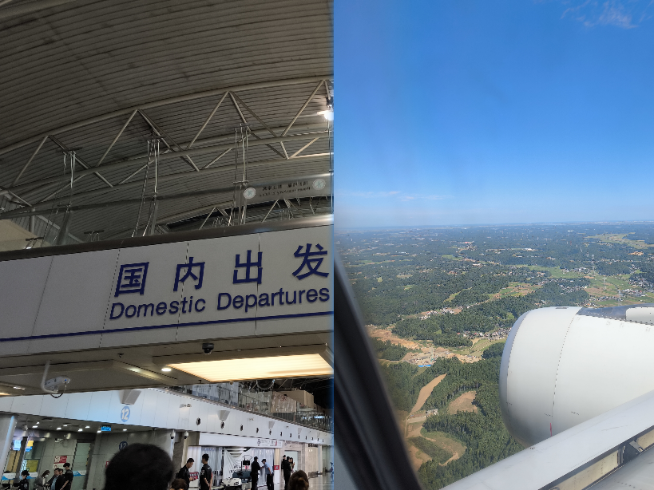
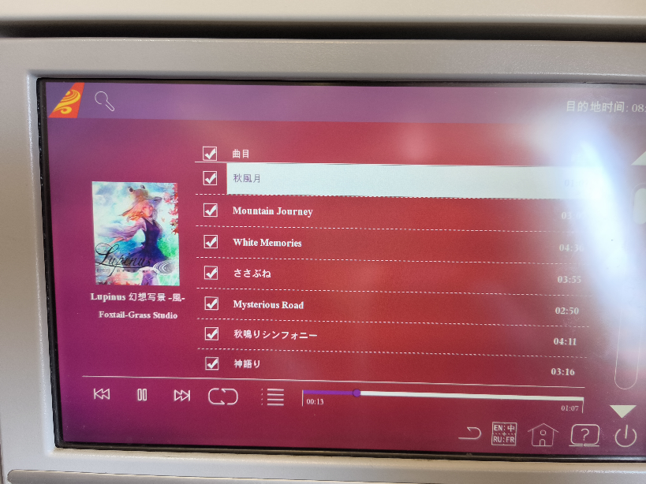
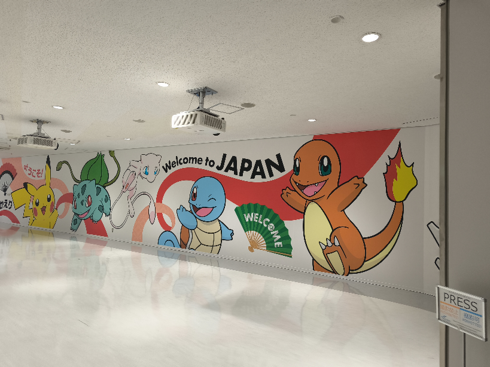
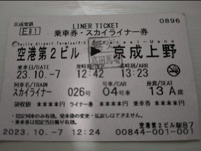
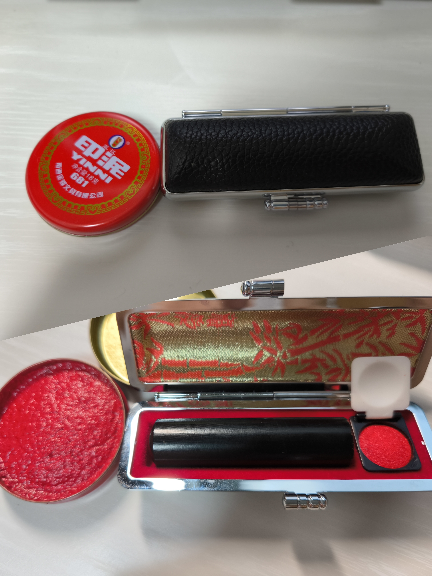
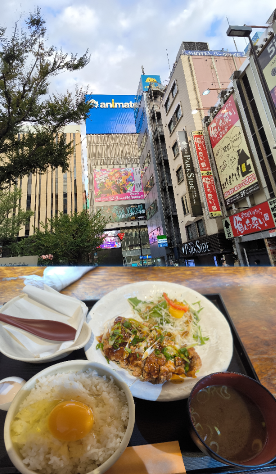
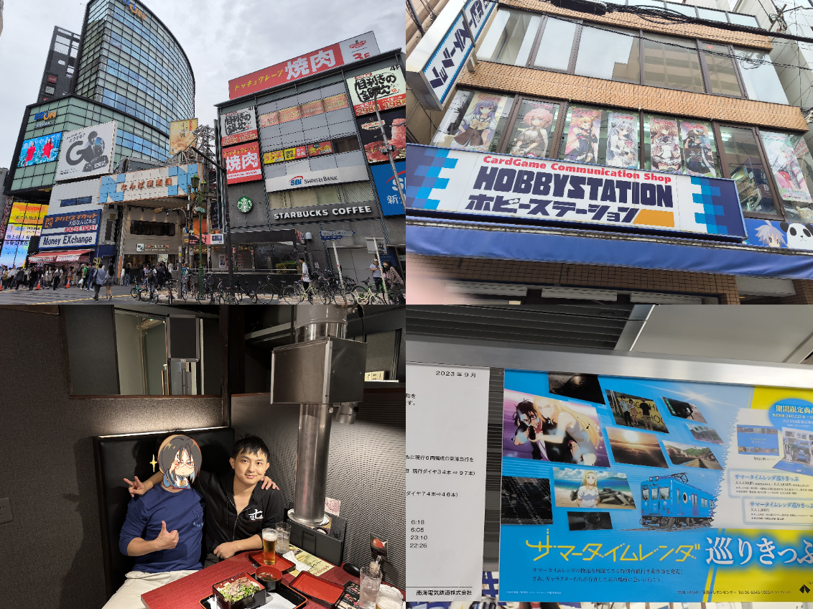
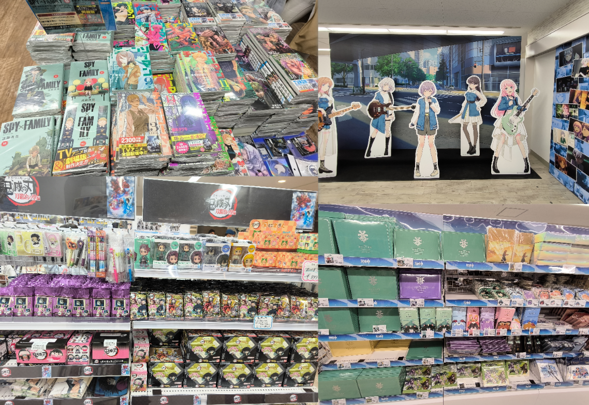

# 正的留学日记 - 其一

## Start

- 2023 年 10 月 07 日

乘坐从北京到东京的航班，我迈出了日本留学之旅的第一步。

海南航空的歌单上居然有 [东方](https://zh.wikipedia.org/wiki/%E6%9D%B1%E6%96%B9Project) 的专辑，赞一个👍

---

## Save.01

- 07 日中午 12 点左右，落地日本成田机场。

没有在国内买好海外流量卡的同学（比如我），机场、高铁、地铁都有免费 WiFi。  
说实话我也不确定够不够用，反正保险起见我先蹭 WiFi 开了个临时的日本流量包。

> 国内买的海外流量卡挺坑的，很多不是走的日本三大运营商的正规线路，  
> 所以我是直接在 MIUI 全球上网 App 买了 1G/7Days 的日本流量包。  
> 不过说实话也挺坑的，网速很慢，只能说勉强能用。

行李不多，时间也还早，我没有叫接机（一万日元），而是搭乘 Skyline 天空专线（京成电铁）从空港（机场）前往日暮里站（2300 日元）。

> 可以直接通过官网在国内预定，会收到一个二维码，到了机场直接在柜台兑换车票就行。  
> 纸质车票插入检票口、通过闸机后要记得取回！我就忘了，然后找工作人员帮我取回的，是一个很亲切的大叔。  
> 兑换车票时注意发车时刻，尽量选择时间充裕一些的，以防意外导致赶不上。  
> 玩过 P5R 的应该知道，日本站台挺复杂的，没那么容易找到你的目标车次。

抵达日暮里站后，我选择转乘地铁 JR 山手线前往高田马场站，到预定宿舍的公司去办理宿舍入住的手续。  
很多日本留学分享都提到过要提前准备印章，这里就是第一个派上用场的地方了。

> 高田马场的发音很有意思，たかだのばば，笑。

办理完入住手续，宿管老师直接安排人送我到了宿舍所在地，池袋本町。  
来的不巧，赶上日本三连休，住址登录手续暂时无法办理，导致日本手机卡、日本银行卡乃至 Google 账号转区、Google Pay、Mobile Suica 等一系列东西都被拖累无法办理。。。  
当天（07 日）剩下的时间，只能先办理了一张临时的 UQ 手机卡，和隔壁的舍友出去逛了逛，吃了顿饭。回来美美的泡了个澡解解乏，如此，第一天结束。

---

## Save.02

- 08 日。

昨夜泡澡时得知，高中时期的好兄弟居然正好在日本旅游，遂前往大阪日本桥动漫街与之相会。

> 路线：搭乘 JR 山手线到品川，再从品川乘坐东海道、山阳新干线前往新大阪，最后转乘御堂筋线前往难波。

十年了，各自都经历了许多，但容貌都变化不大，相互一眼就认了出来。

晚上回到池袋又去了趟 Nitori，因为昨日买的寝具三件套只有枕芯、被褥芯，没有枕套、被套、床单。。。  
顺便又买了桌灯、地毯、沐浴用品等，淋了点雨，回来又美美的泡了个澡。

> 悲催的是，最后一刻我嫌床单颜色不好看换了一个，结果没注意换成被单了，于是买了两件被单。。。好在及时发现，没拆封，明天再去换吧。  
> 昨天的购物清单丢掉了，还好下载了一个 Nitori App 并登录了会员，可以从中查到昨天的订单。  
> Nitori 是不卖沐浴露、洗发水的内容物（なかみ）的，只有空瓶子。这边习惯内容物是袋装、注入到瓶子内用的。

> 日语还是不太行，拿着翻译软件，借着手势用简单词汇勉勉强强沟通。  
> 路上遇到个不知道是宣传还是干啥的，本来想说日语有点难，我还太不擅长，  
> 即「難しい」，但脑子没转过来，想不起来怎么读，查了下「難い」，然后就读成にくい了。  
> 现在想想对方反应，可能搞出歧义了（发音同「憎い」）。。。不知道有没有机会纠正了。  
> （P.S. 可能是因为当时满脑子都是那句「日本語食べません」，被荼毒了。。。）

> 吐槽一下，MIUI 在国外是真的难用，Google 地图无法显示方向，日本 SIM 卡设置套餐点了就闪退，天气预报只能精确到东京，一点都不准。

---

## Save.03

- 09 日。

逛了逛 Animate，这男女比例是不是有点问题，好多漂亮小姐姐！

不小心逛到乙女区了，有点尴尬。。。

怀念我的收藏品了，出国前几乎都低价处理掉了，心疼。

有很多想要的东西，不过得忍耐，等稳定后再带它们回家。

去 Nitori 把买错的被单退换了，又添置了一些生活物品比如纸巾、香薰、钱包之类的。

今日无事了，明天开学报到，查查路线做做准备。

