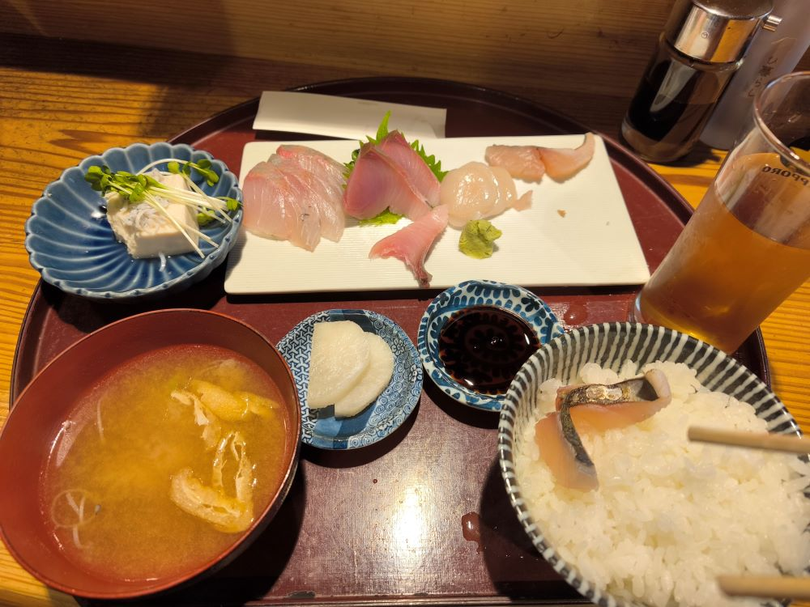
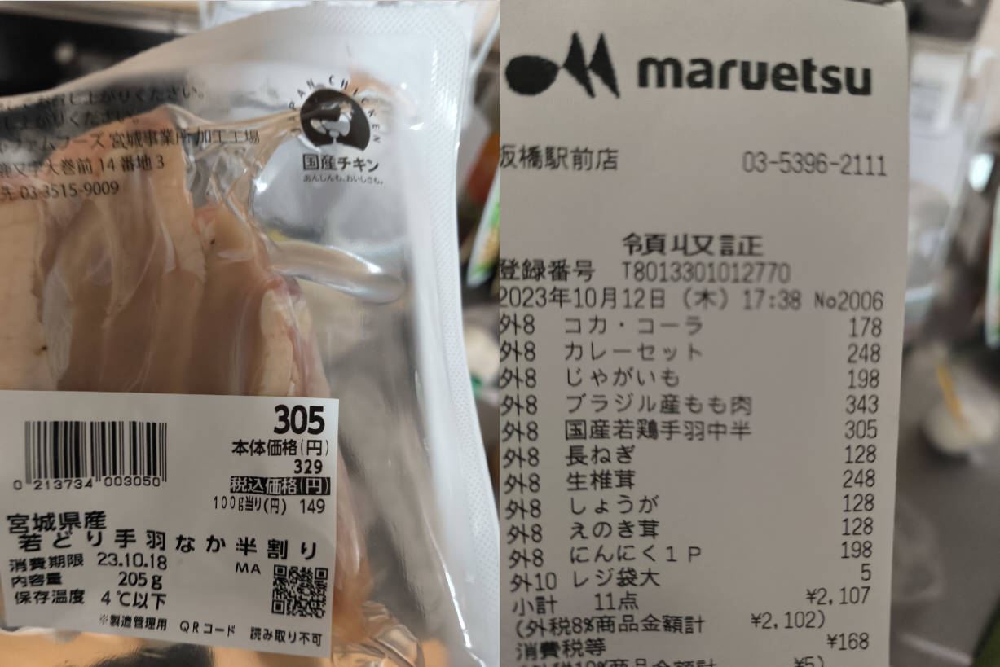

# 正的留学日记 - 其二

## Save.04

- 2023 年 10 月 10 日

早上前往高田马场的千驮谷（千駄ヶ谷）日本语学校报到。  
本来按分批我是十一点的，到早了，直接跟着十点场的参加了分班考试的笔试。  
分班考试笔试题居然有作文题，傻眼了，不会写，胡乱写了一通交上去了，大概率分班要凉凉。。。

报到完成后看时间还早，直接联系租房中介，去池袋区役所集合，办理住址登记和居民保险。  
路上找了家小店吃了顿刺身定食，份量一般，只能吃个八分饱。  
服务员不小心把汤弄洒到我裤子了，她一个劲儿的私密马赛，我一个劲儿的呆胶布。。。

路上还遇到了一个小神社「大鸟神社」，名字不错，不知道祈求啥的，是顾名思义那种吗（歪嘴笑）？  
不知道供奉的是啥所以没敢随便进去，在外面随便拍了两张。还看到个大叔在门口双掌合十闭目祈祷。

> MIUI 是真 ™ 有毒，终于推送了更新解决了返回有时候卡住的问题，结果好嘛，  
> 现在动不动在弹出输入的时候卡住，早知道还不如不更新了，真的像脆换个 iPhone 算了。  
> 还有 Google 地图不显示方向的问题，卸载重装或者清空所有数据后第一次打开方向正常，之后就不行了。。。  
> 我舍友的华为就更不用说了。。。谨戒后来者，别信网上的，以后还是尽量别带国内 Android 手机来日本用了。

> 晚上填了邮储银行（ゆうちょ）的在线开户申请，填完了居然还要打印出来投递到邮局，只能说很符合对日本的刻板印象了。

---

## Save.05

11 日。

早上前往池袋的帝京平成大学参加千驮谷语言学校的开学典礼。  
第二个发表讲话的副校长虽然每句话开头都「唉、」一下，  
但完全脱稿，演讲内容还能和讲册基本对上，应该是个很认真的人。  
还有一个非常活泼的教职代表！有种憨豆先生的气质，感觉是个有趣的人。

典礼结束后还有一个面向中国留学生的讲座。有很多需要注意的规则。  
特别是，千驮谷不允许骑自行车上学，说是为了学生安全考虑，真的很麻烦。

> 我舍友的语言学校都是可以骑自行车的，还提供专门的停车位置。  
> 日本这边不止自行车贵，停车场也很贵！不能随便停在路边的！

> 感觉有点理解 Clannad 智代篇主角为什么要那般忍耐了，  
> 很多对本地人可能不算什么的问题，因为留学生的枷锁，一旦出了事就很麻烦。  
> 虽然很麻烦，但倒是也能理解，反倒是国内对留学生以及外国人太过“宽松”了。

典礼和讲座结束都两点了，去便利店打印昨晚的申请，然后去邮局投递。  
工作人员很亲切，帮我看哪里需要签字、哪里需要盖章，还帮我裁剪邮票单贴到信封上。

一通忙完都三点了，没吃午饭，正巧隔壁小 W 也没吃，我们一合计，干脆叫上小 Z 一起去吃烤肉自助！  
这家烤肉自助有点小贵，所有菜品里的 MVP 居然是那个限量一份（只有一小勺的量）的冰激凌。。。

> 等待汇合前顺便还小逛了一下游戏中心，抓娃娃机是真的坑，本来准备试一试，  
> 看了下旁边小姐姐们的操作，那抓钩软的跟面条一样，还是不浪费钱了。

---

## Save.06

12 日。

> 本来以为今天该上课了，仔细一看今天等分班结果，明天上课。  
> 日本的鸽子真的不怕人，跟走地鸡一样在广场上溜达，从人脚边过去都不怕的。

日本垃圾分类确实严格，昨天周三丢纸壳没赶上，只能再屯一周，今天丢可燃总算没忘。  
难怪动漫里日本お宅经常一屋子的垃圾杂物，实在是没有中国那么方便自由啊。

硬币不小心掉到地板上了，我终于知道在国内烦了我半年的噪音是什么了，哪个脑残天天早上抛硬币啊！

> 住望京花园东区的那几个月，经常早上一大早被一阵越来越急促的叮当声音吵醒。  
> 太久没用过硬币了没联想到，之前还以为楼上有人打乒乓球，但感觉也不太像。  
> 直到日元硬币掉到地上，听到那个熟悉的声音，才明白曾经烦了我几个月的噪音的真相。

陪小 Z 一起去买了自行车。没找到二手（中古）的，新的好贵，税后二十多万日元！  
这还算好了，有一家店里的，我以为是十六万日元，结果叫小 Z 一看，是 160w！我少看个 0！

回来的路上去了趟中华超市，买了些家乡的调味料之类的。最近消费有点高，今天咱们自己做饭。  
我做了个可乐鸡翅，这边鸡翅根又贵又小，三百多日元，内容物居然只有 205g，还不到半斤！  
肉是好肉，但都是对半剖开的，小小的、鸡皮自然也不完整。成菜味道还不错，但卖相真不太行。

> 小 Z 做了个鸡腿肉焖饭，小伙子第一次做饭就挑战这种食谱，很有勇气。  
> 虽然中间忙中出错了一下，但其他环节都没啥问题，挺细心，有天赋 👍。  
> 成品也不负众望，色香味都可以，根本看不出是第一次做饭出来的水平。

这顿饭应该是来日本吃的最满足的一顿了，果然还得是咱们中华料理最合中国人的胃口。

> 坏消息是分班果然凉凉了，分到了下午班，应该是基础班，j1、j2 的课程，大概才 N4、N5 的样子。  
> 虽然我能感觉到之前考的 STBJ 标准商务日语考试很水，但怎么说也考了 795 分，居然才这个水平吗。。。
