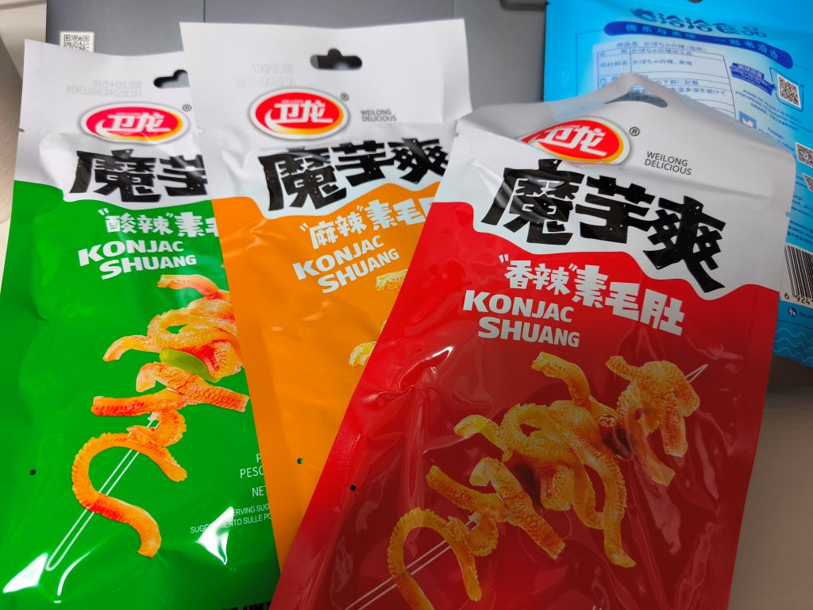
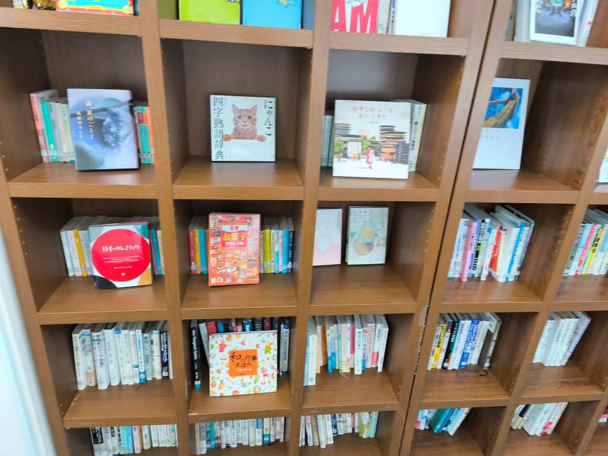
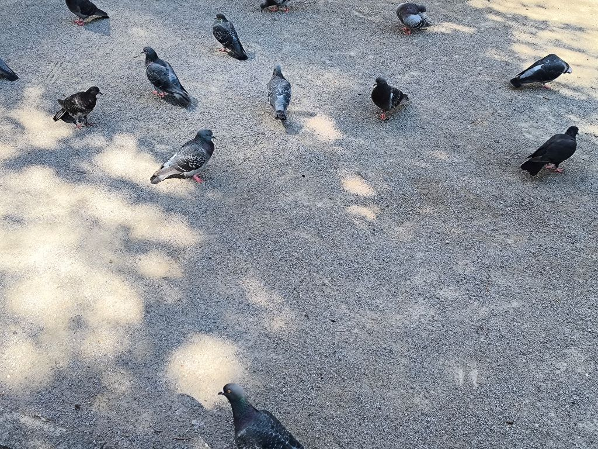
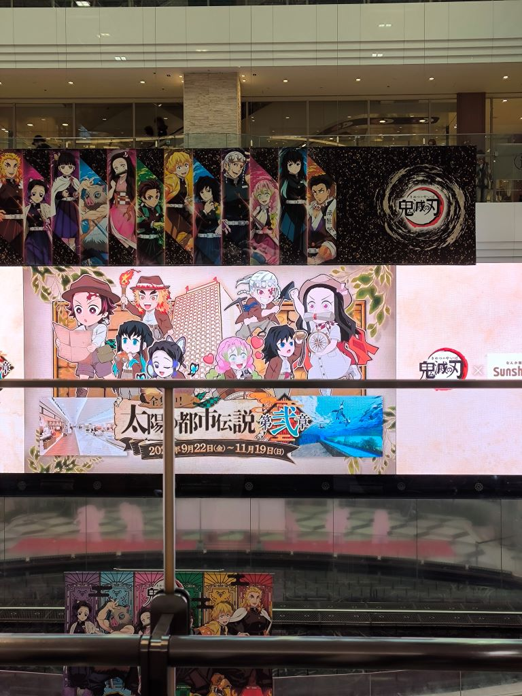
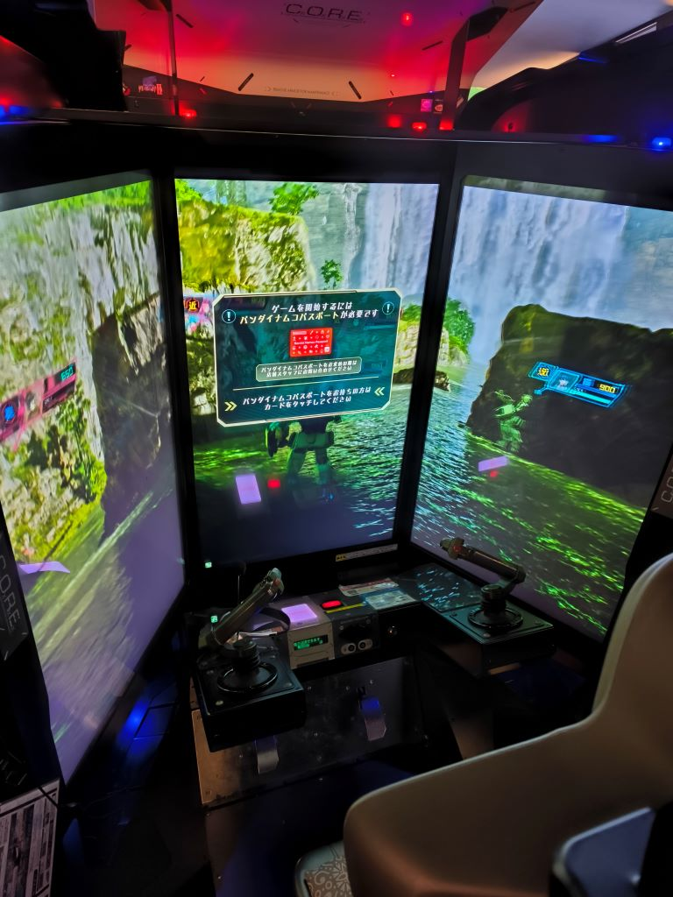
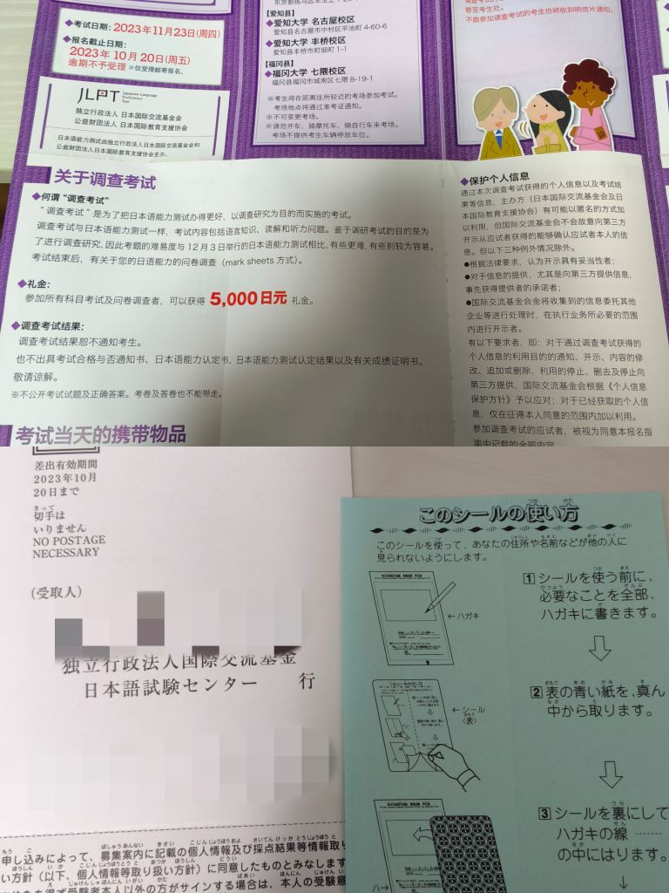
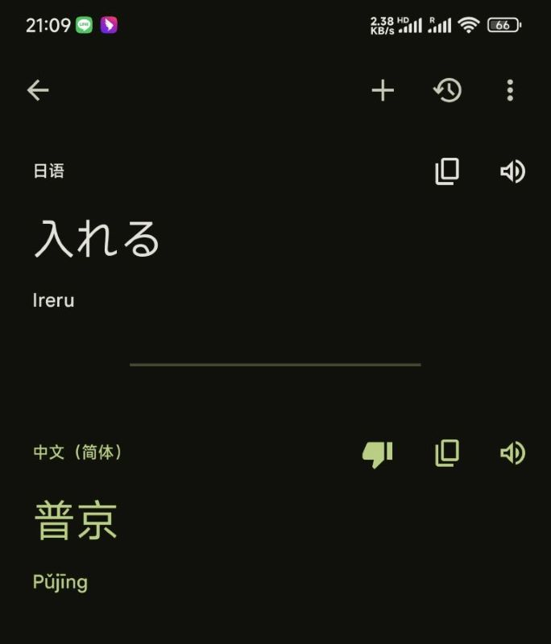
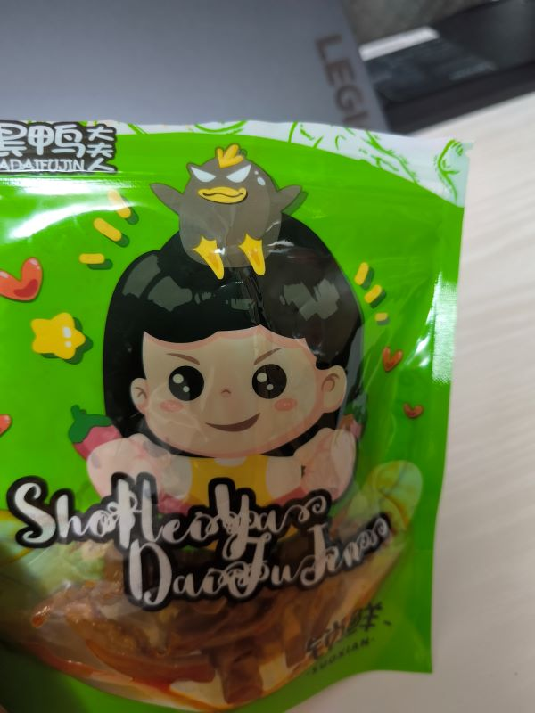
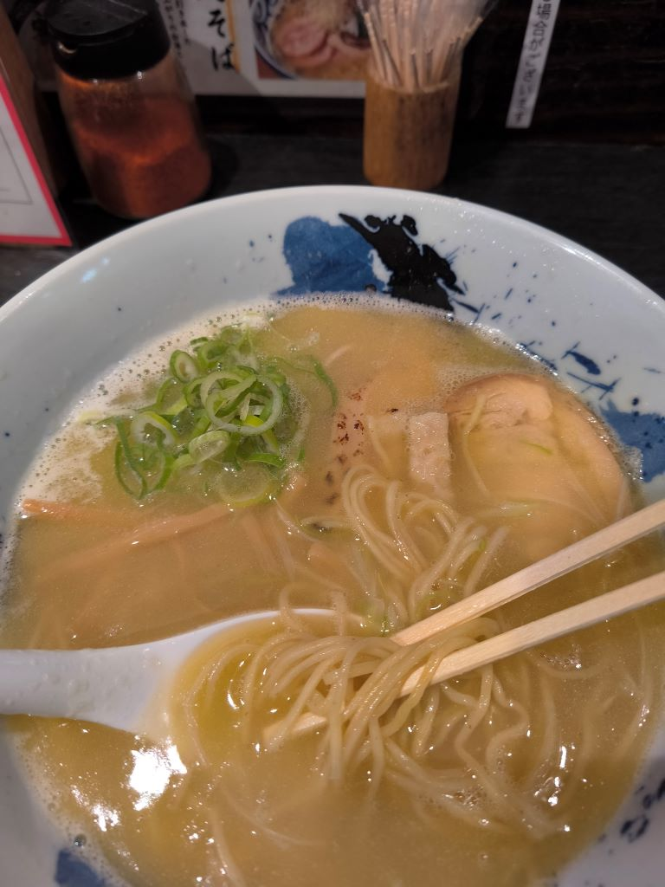
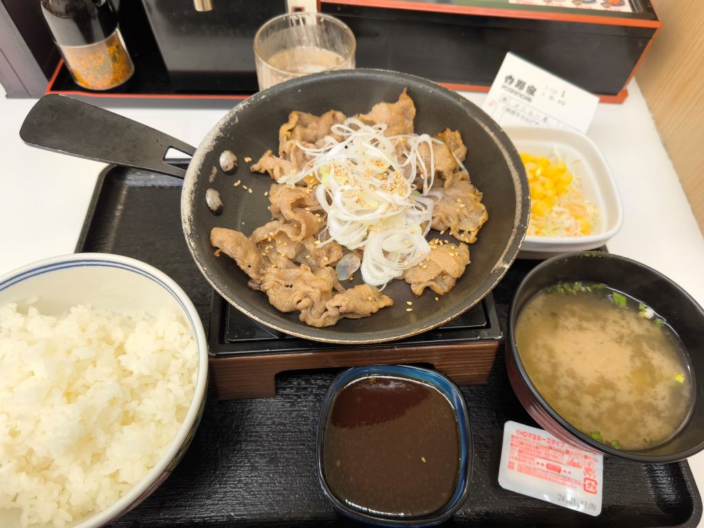

# 正的留学日记 - 其三

## Save.07

- 13 日。

> 昨天忘了发了，这个必须补上：特意从中华超市买的故乡的辣条小吃！魔芋爽 YYDS！  
> 还有，这边无论方便米饭还是泡面包装内都是没有一次性筷子叉子之类的。  
> 要记得向便利店售货员索要。难怪莉爱能跟没见识过一样把一次性叉子掰坏。。。

下午语言学校终于开课了。分到了三号馆 J2 等级的班级，课程相当基础。。。  
唯一好消息是班主任老师很亲切、很有活力。另一个任课老师也挺年轻漂亮。

下午课有个好处是不容易迟到。早点出门，去学校图书室转了转，说实话有点失望。  
图书室相当小，大概也就六七个作为吧，书也不多，大部分不是我现在的日语水平能看的。

> 好在三号馆人也不多，找个座位自习问题不大。

回来的路上去公园逛了逛，看看满地乱爬的走地鸽，稍微思考了一下人生。。。

> 来日本的新鲜劲也散的差不多了。当前最麻烦的事情就是 12 月份的 N1 测试了。  
> 说实话相当后悔，当初为啥脑子一热报了 N1，感觉我现在的水平可能 N2 都够呛。  

> 话说麻雀还知道蹦跶两下，日本这些鸽子根本就是爬行动物，迟早退化成小号肥鸡。

---

> 差不多该加快节奏了，无特别事件就不存档了。

---

- 14 日。

买了点豆腐、猪肉，随便做了顿家常炒肉。

这电磁炉火真的太小了，光是豆腐都煎了有 20 分钟，还没煎透。  
太慢了，实在等不及了，盛出来拿到微波炉里又加热了两分钟。  
味道还行，卖相凑合，忘拍照了。这火真搞人心态，不想做饭了。

- 15 日。

逛了逛趟太阳宫（Sunshine City）。

> 买了点文具、碗筷啥的（之前用的一次性的）。  
> 太阳宫不知道在办啥活动展，鬼灭之刃太阳的都市传说第二章？感觉很久以前好像听说过。  
> 本来还准备买一副健腹轮，导航导了半天也没找到运动品店，回去日亚网购吧。

逛了逛池袋站西口的 Game Station。

地下一层是 VR 体验，节奏光剑啥的。一、二层基本都是抓娃娃机。  
三层记得好像是街机区，四层是网游区，五层是音游区。

> 抓娃娃机有点可惜，泳装初音，投了六个币，还差一点点了，没币了遂放弃。之后再来看已经被人抓走了。

> 四层的高达游戏（機動戦士ガンダム戦場の絆）看着有点像是之前玩的高达 Online。  
> 可惜日语水平还不太行，也没人带，没搞懂咋玩，等以后日语熟练了一定要再来试试。

---

## Save.08

- 16 日。

千驮谷的课程有点太长了，从下午一点半上到五点四十，总共五节课。  
明明 12 月 03 号就要 JLPT 考试了，还得在基础课上花费那么多时间。

> 课堂上是不允许你不听课自学别的内容的，说是影响氛围。  
> 谨戒后来者，尽量把日语水平提的更高些再来语言学校吧，  
> 这里与其说用来学习不如说是用来复习和适应日语环境的。

运气不错，JLPT 调查考试好像抽中我了，20 号前提交申请（邮递）报名参加。

> 这个调查考试参加就有 5000 日元的奖励，还能提前适应一下考试和环境，真香。

> 放弃用 Google 翻译查单词了，这都翻译的啥垃圾玩意儿啊，还是用 MOJI 辞典吧。

- 17 日。

昨天拿到了通学证明，今天终于把通学定期西瓜卡办出来了，以后上下学就方便了。  
日本这边说由于半导体短缺，个人不记名西瓜卡已经暂停发售了，不过不影响通学定期卡。

> 定期卡在绿色的窗口（みどりの窓口）办理，必须填写姓名的片假名。  
> 由于学校给我开的证明的片假名不是我惯用的，第一次没办下来，  
> 回学校跟老师沟通后，直接按学校证明的片假名写，就办下来了。

吃了顿秋刀鱼定食。感觉没啥味道，甚至有点苦，吃完嘴里都淡出个鸟儿。  
回家路上，正好池袋西站附近有家周黑鸭，看见里面有炸串卖，就试了试。  
好吧，这次嘴巴不淡了，差点没给我油死，这串是拿油当卤水泡出来的吧？！  
总之我不承认这玩意儿是炸串。好在他家的成品包装的鸭肠还是比较正宗的。

- 18 日。

上学路上不知道怎么绕的，反正绕到了一个巷子里，遇到了一家有眼缘的鸡汤拉面的店。  
那鸡汤真是相当浓厚，端上来后迎面就是一股特浓鸡汤味，浓到闻着都有点发腻的那种。  
刚开始吃时面的味道还不错，吃了几口再作死嗦了口汤后，整个人都有点不好了。。。  
趁着老板没注意，拿起水杯直接半杯水冲碗里，嗯，世界都清爽了，汤面还是得清淡些好。

> 正逍遥啊正逍遥！你怎能如此堕落！你是来留学的不是来品赏美食的，子曰：「吾日三省吾身。」不能再这样下去了！

- 19 日。

今天吃了吉野家。

果然连锁店、大众口味是最安全的，不容易踩雷。  
吉野家这顿铁板牛肉套餐，虽然没特别亮眼，但也吃的相当满足。

- 20 日。

周五只上四节课，不过结束时也将近下午五点了。

回家路上吃了顿中华料理，中华荞麦（中華そば）。  
但这玩意儿真的是中华料理吗？？？感觉不如统一、康师傅。

邮储银行（ゆうちょ）的卡好像办好了，收到了保管通知信件。  

> 日本这边贵重邮件是不会给你房门口的，而是先投递一份保管通知，  
> 保管期内，通过电话或者网上预约面对面递交时间，或者自己去取。  
> 但不得不吐槽一下，在线预约填写的编号居然必须得填全角字母和数字。。。  
> 也就是ＡＢＣ１２３这样的，真够奇葩的，程序处理起来不嫌麻烦吗？

日亚上买的健腹轮也送到了。  
从北京、成都、新疆再到日本，这俩月真的吃太多了。  
明显感觉肚子上的保暖层又厚了，该减肥啦！

