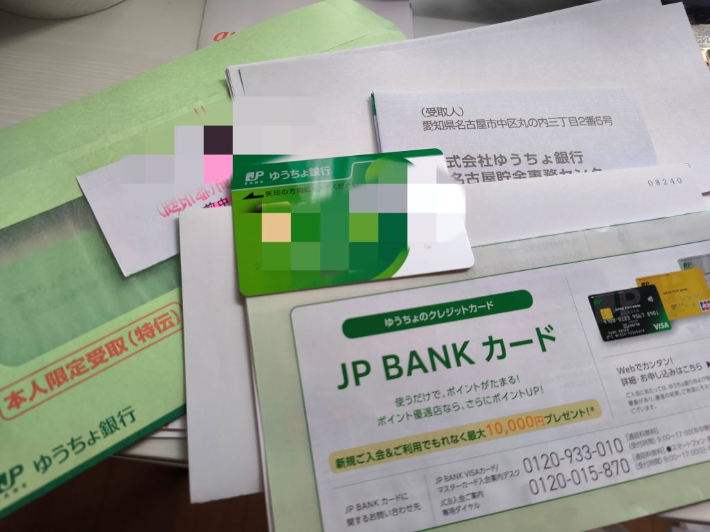
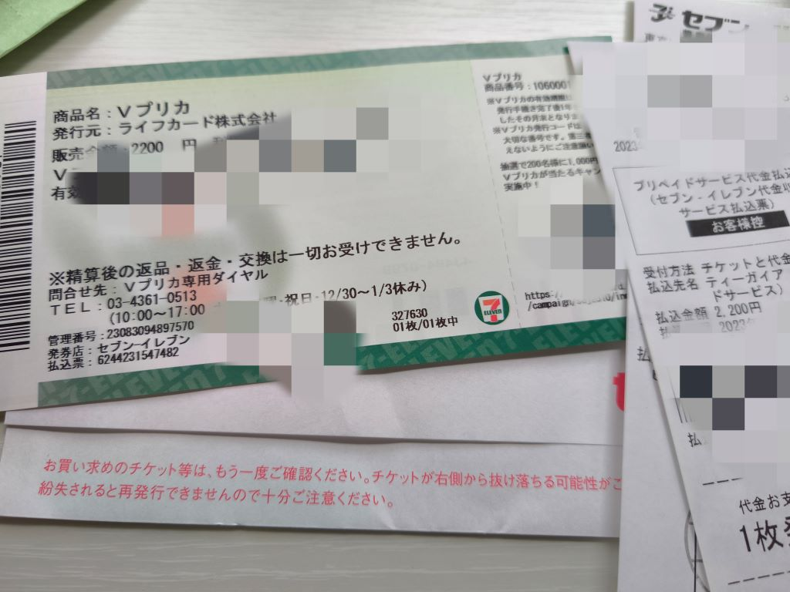
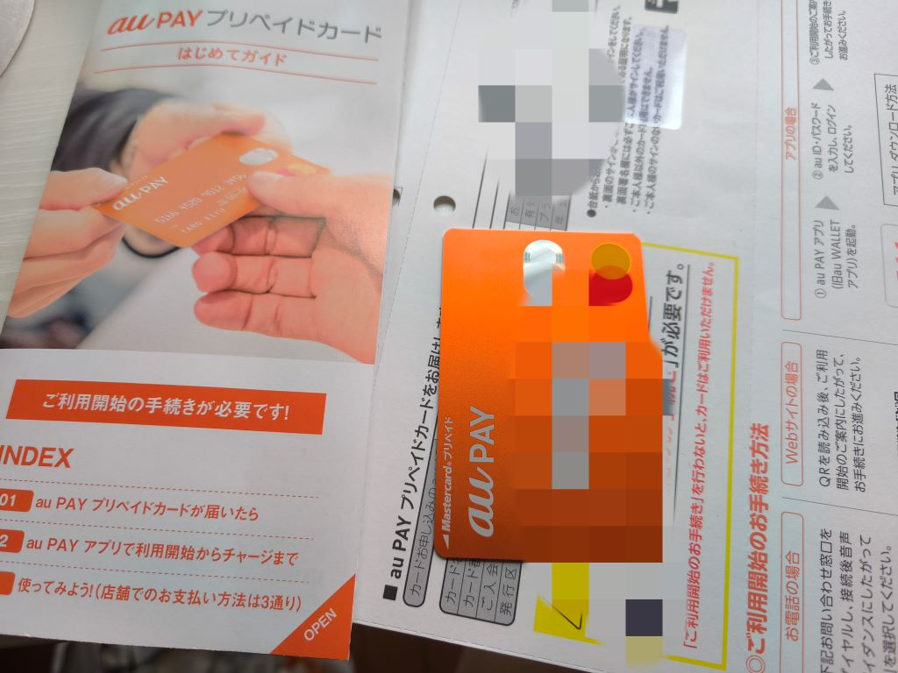
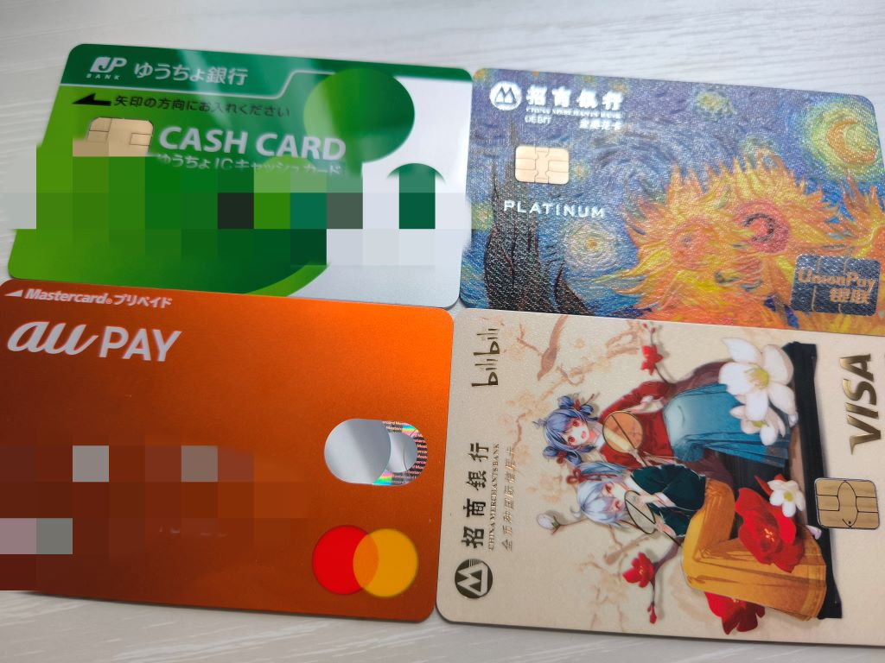
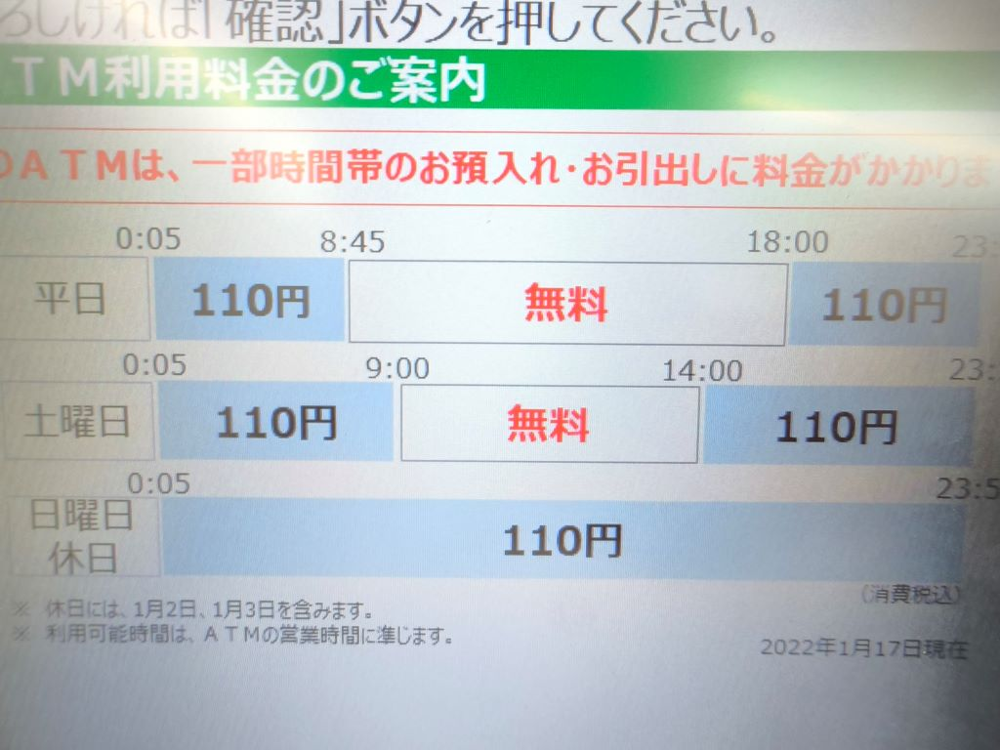
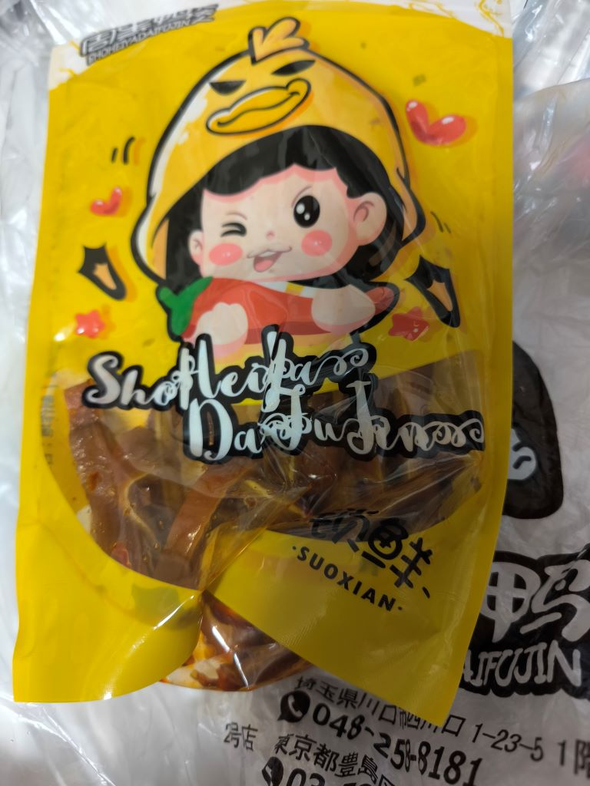

# 正的留学日记 - 其四

## Save.09

- 21 日。

收到邮储银行的卡了，纪念我获得第一张真正意义上的海外银行卡。  
不过要注意前六个月无法直接转账（或者好像是会有很高的手续费？）。

然后经过一番波折，终于把 Google 账号从国区解放出来了。

> 本来打算绑定邮储银行的卡作为支付方式来解锁，结果居然不支持，看来还是得用信用卡。  
> 最终跑去便利店买了 2000 日元的虚拟 Visa 卡，轻松搞定，早知如此何必白等那么久时间。  
> 解锁区后明显感觉多了不少功能，一大堆 App 也终于可以随便用了。

> 网上攻略说日本还停留在现金社会，留学带 20~50w 日元现金比较合适，我觉得这个额度该更新了。  
> 这边确实现金用的比国内多，但也没那么夸张，大部分消费都能刷信用卡、银联卡甚至微信、支付宝。  
> 更别说日本这边自己的移动支付也发展起来了，AU Pay、PayPay、Suica 啥的也挺方便的了。

> 我这次只带了 20w 日元现金，清点了一下还剩 13w 左右，这还是我平时消费没刻意避免用现金的情况。  
> 这么来看，作为前期各种卡没办下来前的临时过渡，不乱花钱的话带 10~15w，平时小额消费应该就够了。  
> 比起大额现金，其实更应该准备一个方便装硬币的小钱袋，我都不知道多少次掏钱包时硬币掉一地了。。。

做了顿韭菜铺鸡蛋，我家里的做法，介于炒和蒸之间，特点是比起炒的，出菜后鸡蛋更加鲜嫩。  
日本这边的鸡蛋好像不太一样，虽然可生食，但闻起来蛋腥味有点儿重，放了点胡椒粉压了压。

- 22 日。

突然收到一张 AU Pay 的万事达卡，想起来之前注册 AU 时好像是顺手填过几个步骤，后来就懒得管了。  
没想到这就把卡办出来了？这对留学生相当友好啊，不是说一般得六个月后才能办出日本的信用卡吗？

免年费，可以直接在便利店 ATM 存款，绑定了 Google Pay、PayPal 等也没啥问题。  
看起来跟正常的卡区别不大，正好我手头只有张 Visa，填补了 Mastercard 的空缺。

不过卡面好简洁，远没有我的招行的储蓄卡、信用卡漂亮。  
懒得折腾了，等六个月后再考虑更换卡面或申请别的卡吧。

> 邮储的卡真难用！小柔视频里说日本 ATM 准点“上下班”的情况我倒是没遇到，  
> 但邮储的卡，除了限定时间外要收 110 日元手续费！ATM 居然都有加班费？！  
> 但 AU 那张卡就没有手续费，而且 App 以及便利店支付体验比邮储的方便多了。

今天吃了池袋西的一家居酒屋，服务员说中文，真的体会到了啥叫中国人专坑中国人。  
那酒真的相当难喝，根本就是纯水兑点儿酒精。牛肠不知道煮了多久，烂糊成一团。  
烤串就鸡皮和鸡脆骨肉质还行，调味很淡或者说没什么调味，自己浇了点辣椒面。  
最恶心的是一落座端上来的三小碟凉菜，结账才告诉你是收费的，一碟 400 日元。。。  
一顿饭花了两千多，评价是还不如回去的路上 500 日元买的周黑鸭的猪耳朵吃的过瘾。

> 这次先就先发这两天的，将发布日调整到周末，以后就降到一周发一篇了。  
> P.S. 怎么每天都能听到救护车的声音，我是生活在冬木市不成？？？
