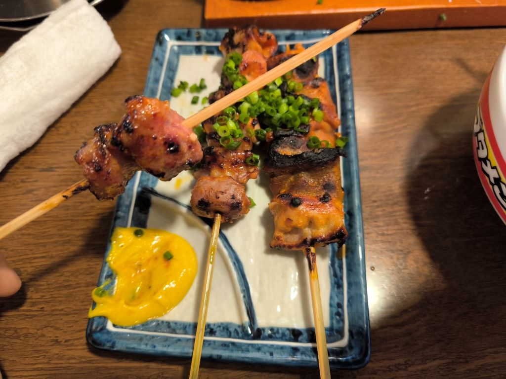

# 正的留学日记 - 其五

## Save.10

- 23 日，周一（月曜日）。

降温了，中午还有点热，但昼夜有点冷了。

今天用 Uber Eats 点了顿外卖。  
先白嫖了一个月会员免配送费，又用了新人福利减了 1500 日元。  
最后用 84 日元点了份 King Cafe 的买一送一的「温玉タコライス」。  
两个小盒，量有点少，我吃了一盒半吃饱。味道还行，挺划算的。

> 顺便一提 Uber Eats App 做的真垃圾，和国内美团、饿了么的体验完全没法比。

- 24 日，周二（火曜日）。

今天上了第一节汉字课，毕竟是基础班，没办法。。。

> 不过还好，主要是强调一下中日汉字的一些不同写法和读音，比想象中的进度快很多。

日语的序、数、量词是真的麻烦，这么看琪露诺能数到 ⑨ 说不定还真是个天才呢。。。

今天赶上一家超市促销，100 日元一盒便当、50 日元一盒小点心，各买了三盒，很话算。

> 明太子的便当味道不错，鱼子很鲜美，之后又从超市单独买了一盒「辛子明太子」回来。

我擦！！！我说 Animate 前怎么排那么长的队，居然是在发放 Re0 的万圣节巧克力！！！  
话说今天也是 1024 程序员节，这边好像没啥活动啊，看来国外不怎么过这玩意儿。

- 25 日，周三（水曜日）。

白嫖了一波 7-11 的 7 Now App 的 3000 日元减 2000 的活动。

> 这 App 也是体验极差，选单、探索、详情页等给我感觉就大学作业的水平。  
> 最离谱的是我都支付成功了，结果回调页面被转到 Google Play，就卡死了。  
> 然后过了一会儿订单居然直接自动撤销了，理由是无法判定是否已支付。。。  
> 我就很好奇，你们不做服务器回调的吗？这么放心客户端跨 App 通信的吗？

- 26 日，周四（木曜日）。

煮了些茶叶蛋。额外还泡了个生鸡蛋进去，搞了个温泉茶叶蛋。  
可惜没怎么入味，应该是茶叶问题，抹茶绿茶不太行，还是得用红茶。

去了家居酒屋，花了一千多日元，吃的还不错，也没啥奇奇怪怪的收费。  
这家烤串很香，500 日元三串。还有个黄色的不知道混了啥的芥末酱。  
说起芥末，在国内的时候吃日料我是一点芥末都不碰的，太冲鼻子了。  
但日本这边的芥末反倒没那么冲了，感觉更柔和一些，吃着还挺爽的。  
特别像这次这个黄色的芥末酱，不知道混合了什么东西，跟烤串挺搭。

> 关于上周日那个居酒屋的前菜与座位费这个事情，我后来查了查。  
> 日本这边确实有这样的说法，还没点单先直接上一份小菜，代替座位费了。  
> 但第一是比较高档的店才会搞这玩意儿，大多是公司下班了一群人一起包间。  
> 第二，人家端上来的小菜是有诚意的，不是几粒凉拌黄瓜丁就凑合了的。

> 总之上周日遇到的那家路边小店这么搞就纯属坑人的，酒和菜还那么垃圾。。。  
> 像是之前和语校同学一起那次，还有今天吃的这家，就根本没这种套路。

- 27 日，周五（金曜日）。

又去了一趟之前的超市，买了一堆促销便当和小点心。  
然后发现了一个蛋疼的事情：不是 100 日元一盒！是一盒减 100 日元！

- 28 日，周六（土曜日）。

天气渐冷了，今天跟隔壁舍友一同出门买衣服。

先跑了趟奥特莱特，发现这家不卖衣物。又跑了趟西武商场，发现这里都是五位数起步。。。  
最后还是跑去了优衣库（ユニクロ）买了一身，外套内衫裤子一共花了一万多日元，感觉还行。

> 顺便下了个优衣库的 App，注册了会员。已经懒得吐槽这边的 App 有多奇葩了。

回去前吃了顿回转寿司。

> 想吃的从面前经过了直接拿，最后按盘子花色计价格。  
> 味道还行，就是不顶吃，一不小心就吃了两千多日元。

> 想起之前有次去南京吃的回转自助了，  
> 记得有也有饭团和寿司，还有其他小菜甜品啥的。  
> 当时好像总共才花了五十多人民币，吃的饱饱的。

回家路上经过 Animate 顺便又进去逛了逛。  
门口广场有活动，布置了不少东西，不过看来已经结束了，没看到几个 Coser。

- 29 日，周日（日曜日）。

今天去 Nitori 再买些衣架回来，路上又 `碰巧` 经过了 Animate。

这次活动好像开始了？又好像没彻底开始？总觉得不够热闹。  
路上遇到个欧美 Coser，出的哪个角色忘了，反正感觉不怎么搭，  
因为她太太太高了！很出戏的好吧！不过那大长腿给我的印象很深。。。

> 应该是去早了，还没开始，隔壁舍友下午回来说还人还挺多的。

回去路上去唐吉可德扫了扫货，还是唐吉可德东西多些。  
买了盒猪肉炒菜用，750g / 760 日元，感觉性价比还行。

晚上做饭总算攻克那个倒霉灶台了。主要问题是火小，爆炒温度不够。  
一开始准备油炸，200° 按理说够了，炸透了再炒，结果炸了半天没动静。  
然后分析了一下，应该是食材有水分加上刚从冰箱里拿出来，导致锅凉了。  
于是用两个锅，一个锅专门用来把食材加热加热，然后转移到另一个锅炸。  
分多次一点点来，总算是听到了美妙的油滋声，做出了炒菜而不是炖菜。

> 不过有个问题就是肉太瘦了，几乎没有肥肉，炸出来的有点柴，不够香。  
> 另外量有点太大了，锅小，翻炒不动，最后分成了两份，用两个锅来做。

