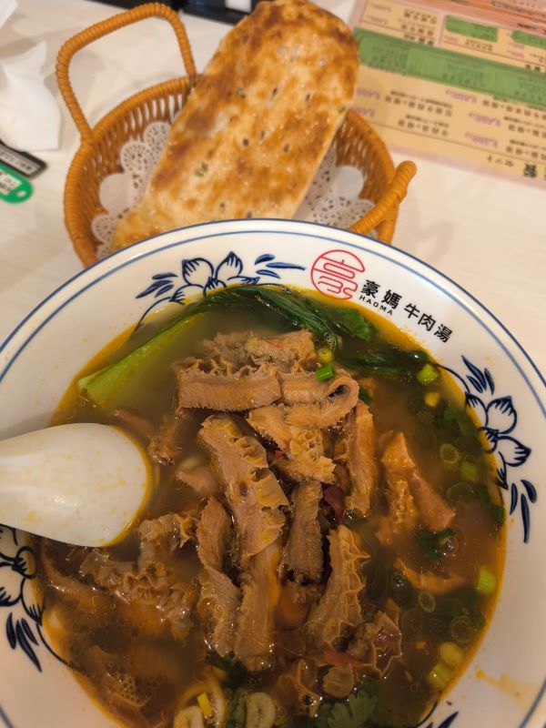
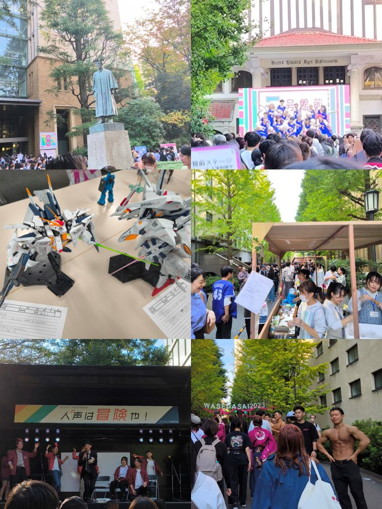

# 正的留学日记 - 其六

## Save.11

- 30 日（月曜日）。

感觉还是想吃中餐，吃了顿牛肚汤加烧饼套餐。  
味道还不错，就是对比国内物价实在是有点小贵。

晚上涩谷万圣节好像有活动，纠结了去不去，犯懒了，放弃。

- 31 日（火曜日）。

今天换座位了，好像是一个月一换。  
从后排靠右变成了后排靠左。后排靠窗，王的故乡。  
总算可以矫正一下之前一直向右拧的脖子了。

池袋西有家疆莱，吃了顿手抓饭，店里装修气氛倒是不错  
但感觉比我自己做的也强不了多少，远不如我舅做的好吃。

- 11 月 01 日（水曜日）。

今日无特别之事。晚上试了试日式荞麦拌面（油そば）。  
调味油和酱需要自己添加拌匀，味道意外的还挺不错。

- 11 月 02 日（木曜日）。

今日亦无事。晚上在家炸串，博多什么牌子的半成品串。  
味道还行。另外又顺便用微波炉试着炸了盘土豆片。

> 垃圾哔站又出 Bug 了，部分直播加载不出来，不知道啥时候能修好。

- 03 日（金曜日）。

今天日本文化日，学校放假。在家里做了顿红烧肉炖土豆。  
从中华超市买的冻的带皮五花肉，日本超市卖的那种肉真不适合做中华菜。  
卖相还行，但不知道是糖和盐放少了还是粉丝把汤汁吸收了的缘故，比较淡。

- 04 日（土曜日）。

今天早稻田大学举办早稻田祭，跟隔壁舍友去逛了逛。

> 说实话有点失望。到处都人山人海，偶尔有感兴趣的活动还得排老长的队。  
> 有不少学生社团摆小吃摊，但做出来的东西是真的又难吃又贵。。。

路上经过了诹访神社、放生寺和一个比较大的忘了叫啥的神社，进去随便逛了逛。  
总觉得提不起太高的情绪，可能是因为毕竟是来留学的吧，没有旅游的那种心态。

晚上去吃了顿自助寿喜烧（すき焼き），虽然感觉跟印象中的不太一样，但吃的很爽。  
回家前跟隔壁舍友去玩了几局台球，菜鸡互啄。不过没想到是按人头而不是按场地收费。

- 05 日（日曜日）。

本来打算再去早稻田看看，今天有东京花火表演。不过又犯懒了，没去。。。

上次还剩了一半的肉，今天再次挑战红烧肉炖土豆。这次盐和糖全部加倍再加倍！

> 最终感觉还是有点淡，按说不该这样啊，有点离谱，难道是被土豆粉丝把汤汁吸掉了？  
> 下次再有心情做的话，不放土豆和粉丝了，纯做红烧肉试试到底是怎么回事。

三天休息结束，明天又要上课了。

> 感觉最近也没啥新鲜事情可写了，总是写吃的也没啥意思。
