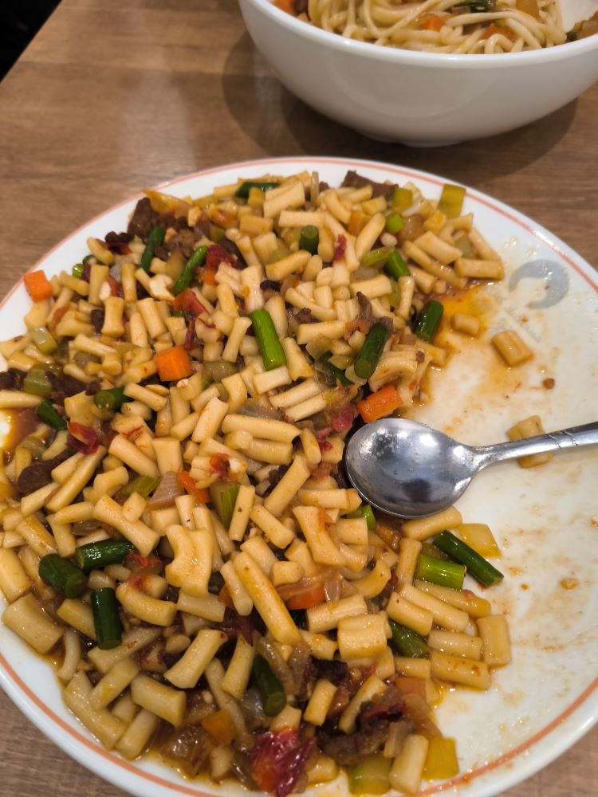

# 正的留学日记 - 其七

## Save.12

- 06 日（周一）

今天试了试一兰拉面，味道确实不错。  
要说多惊艳也不至于，不过确实比平时吃的拉面好吃些。

> 放学后绕道去了趟池袋东。  
> 本来打算买点便当点心什么的储备着，  
> 发现一兰拉面这次正好没什么人排队。

- 07 日，无事。
- 08 日，无事。
- 09 日，无事。

- 10 日（周五）

舍友一起去又去了一次疆莱。  
这次没要抓饭，试了试他家的丁丁炒面，感觉还不错。  
份量很足，满满一大盘，肉也不少，吃的挺过瘾的。

- 11 日（周六），无事。

- 12 日（周日）

艹，早上收到联通电话才知道，我上个月买的流量包不是一次性的。  
这个月流量包给我自动续租了，又白白浪费了 30 块钱。

晚上炸了两包串，微波炉烤了一盘土豆，剩下的油做了个蒜蓉粉丝。
Emmm，蒜蓉粉丝的蒜蓉有点少了，醋放多了，变成酸辣粉丝了。

