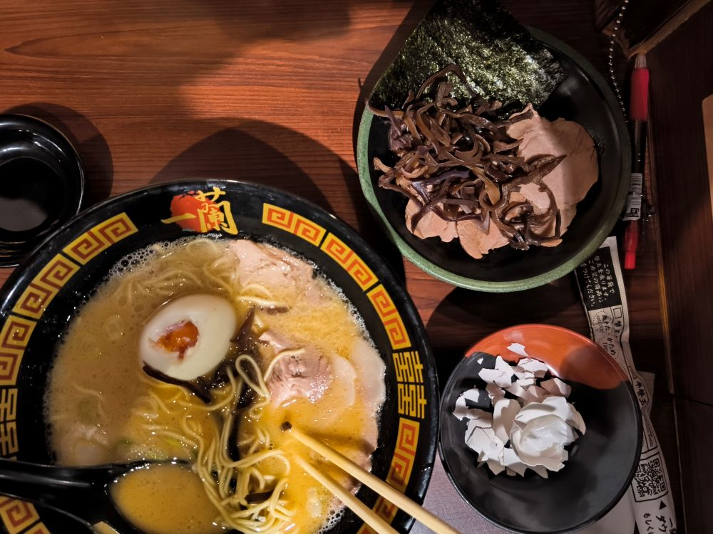
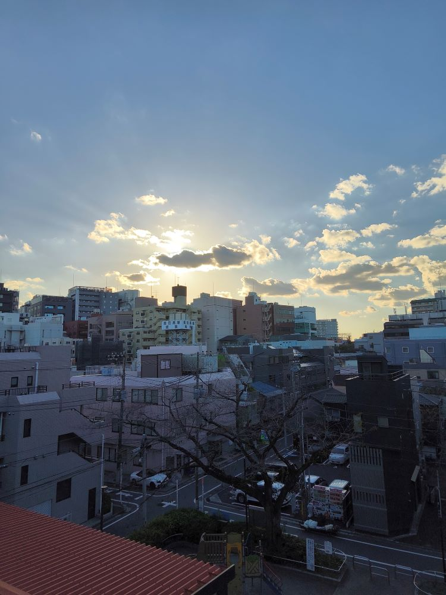
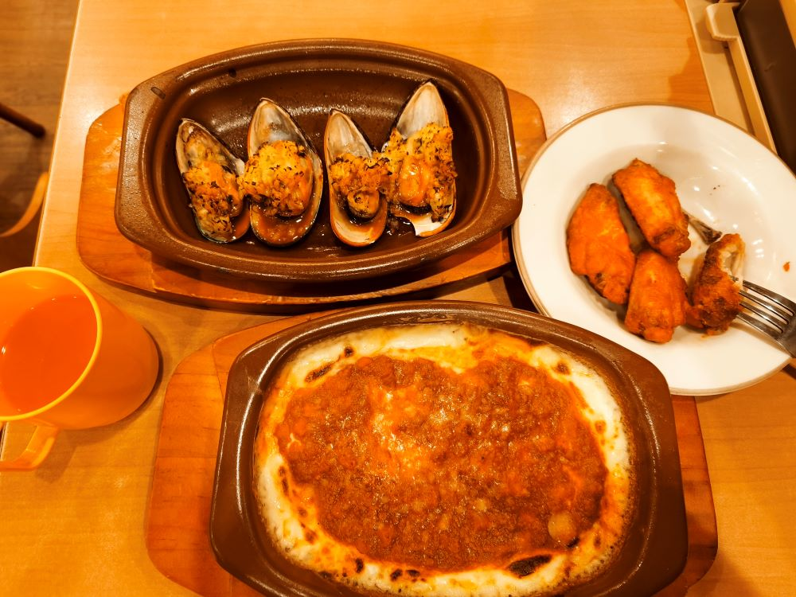
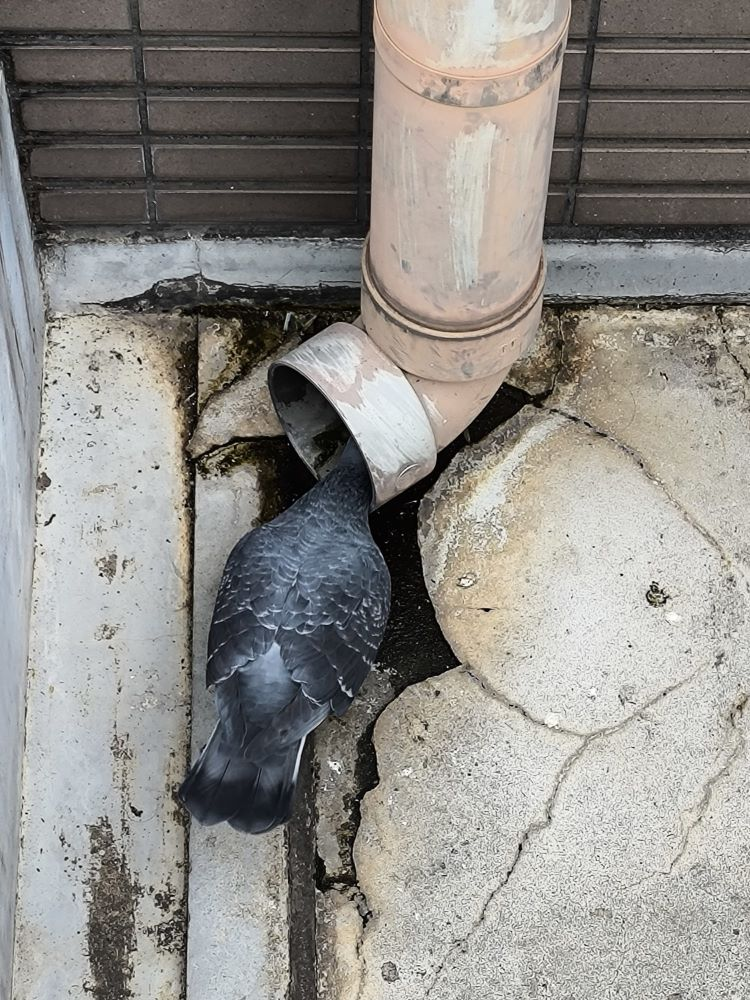
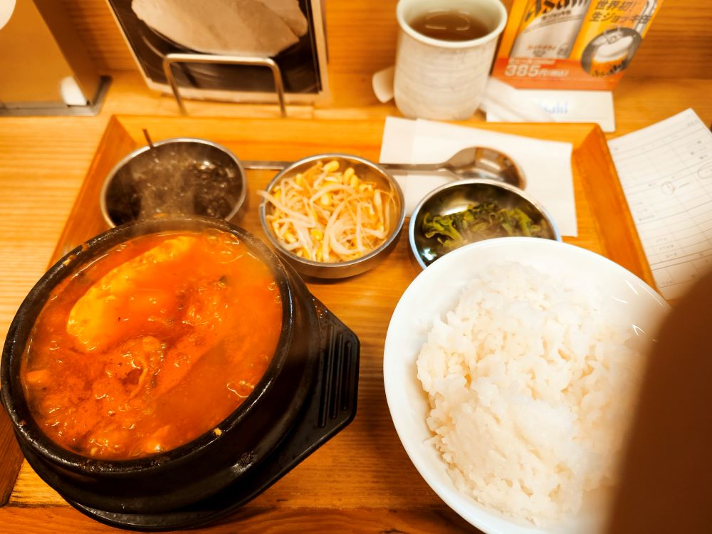
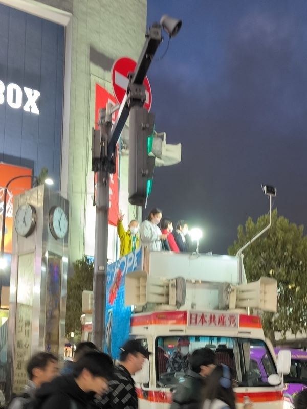
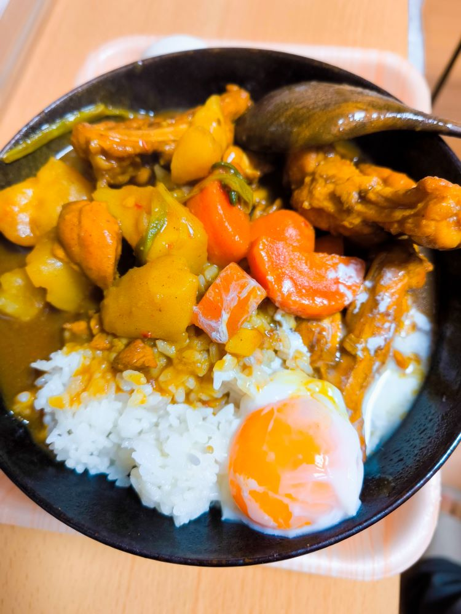

# 正的留学日记 - 其八

## Save.13

- 13 日，周一

又去了次一兰拉面，这次带够了现金，试了试最贵的菜单。  
味道还行，感觉就比上次多了一叠肉片、海苔之类的配菜。

- 14 日，周二

今天天气真不错，天空云彩很漂亮，随手拍了一张。  
已经不记得多久没这种关注天空景色的闲情逸致了。

隔壁舍友推荐了一家平价西餐店，高马车站旁的萨莉亚，今天去试了试。  
确实便宜实惠，1000 日元四个鸡翅中、四个烤贝、一份披萨，饮料自助。

- 15 日，周三

今天在学校楼梯口的小阳台，遇到一只挺“礼貌”的鸽子。  
扑腾扑腾的飞到你脚边，扭着脖子对上一眼，点几下小脑袋，  
然后蹦蹦跳跳的跑到排水管道口不知道在喝水还是捉虫子。  
脑袋点一下、尾巴甩一甩，好萌，好解压啊 ω ω ω

- 16 日，周四

今天试了试高马的什么纯豆腐店，点了份牛什么豆腐的套餐。  
感觉好像是牛肠。豆腐很鲜嫩，不过感觉牛肠和汤才是 MVP。

- 17 日，周五

中午下大雨，上次用完伞挂窗台被吹走了，只能买了把新的。  
上学走到半路雨突然下的特别大，鞋子、裤腿湿透了，好烦。

晚上回去的路上遇到日共的人在搞宣传，试着听了下果然听不懂。

- 18、19 日，周末

无事，在家宅了两天，做了两顿香喷喷咖喱鸡盖饭。  
买了个炊用温度计，控制着温度做了几个温泉蛋。

> 周六的咖喱鸡更成功，周日的有点稀了。  
> 但周日的温泉蛋更成功，周六有点硬了。

吸溜吸溜、  
每一个！溏心蛋！爱好者！都应该！试一试！温泉蛋！
