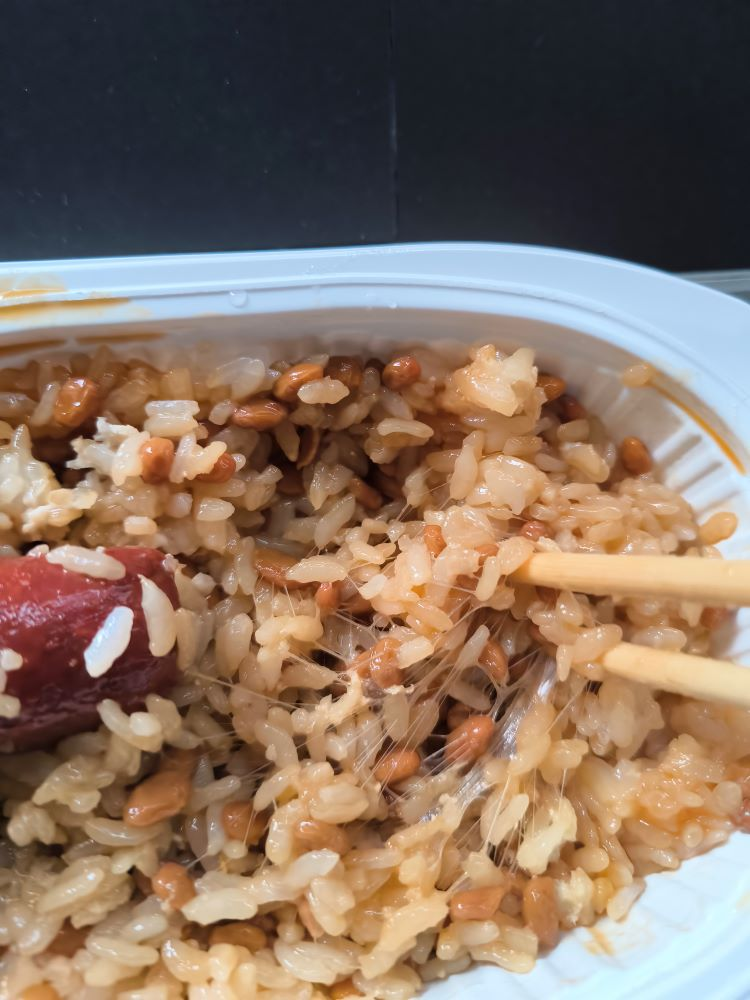
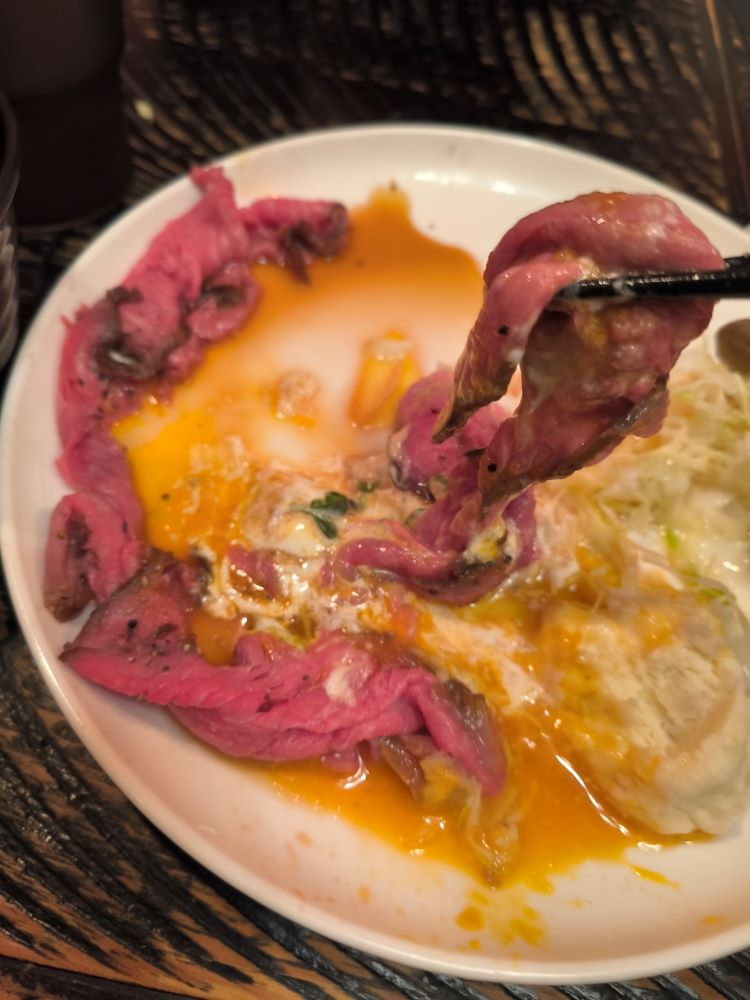
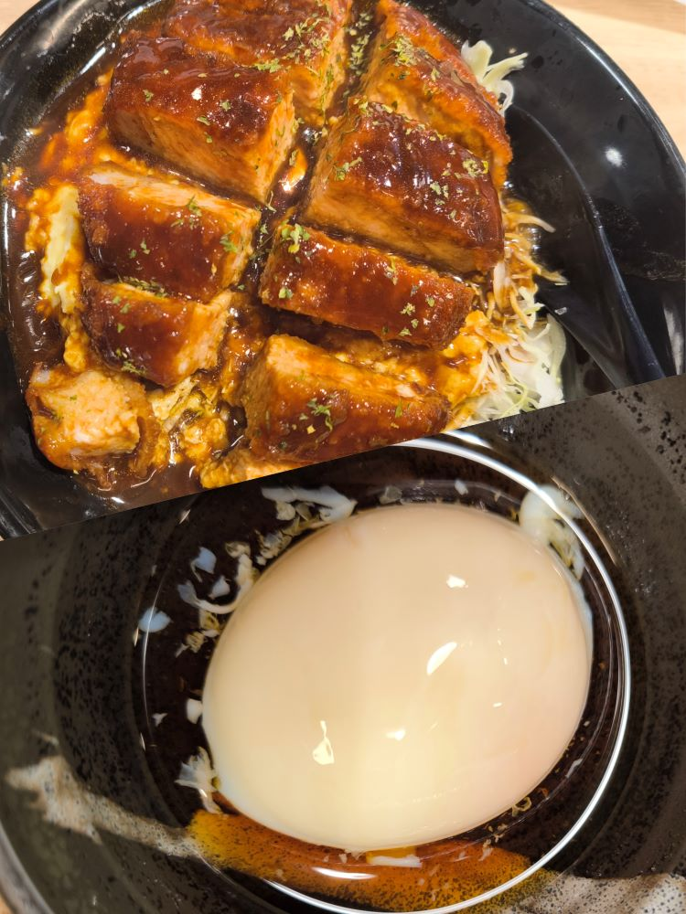
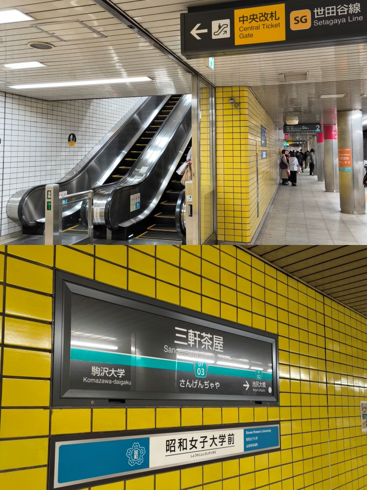
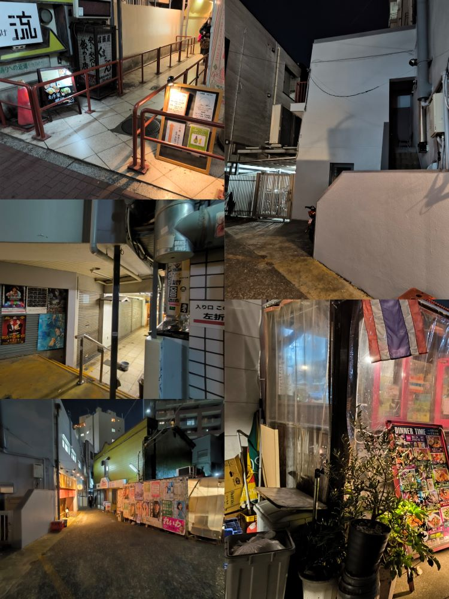
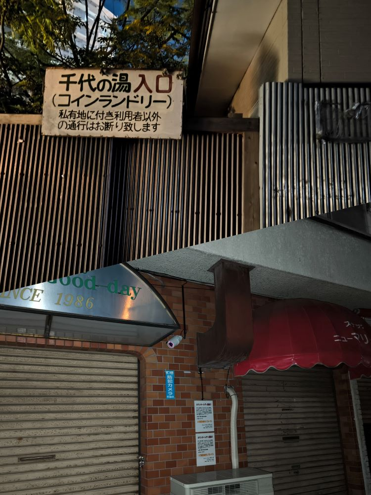
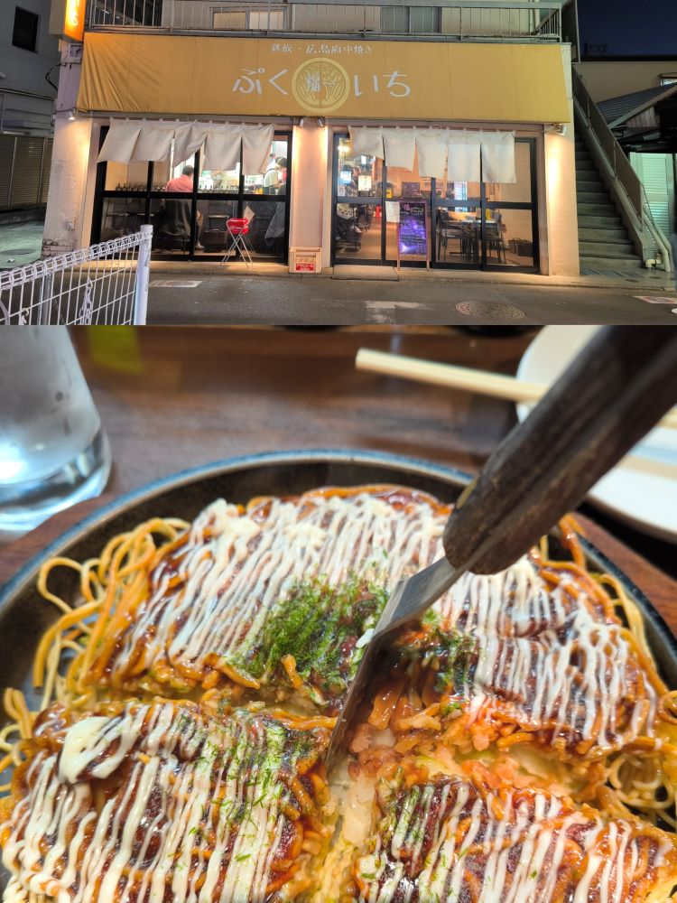
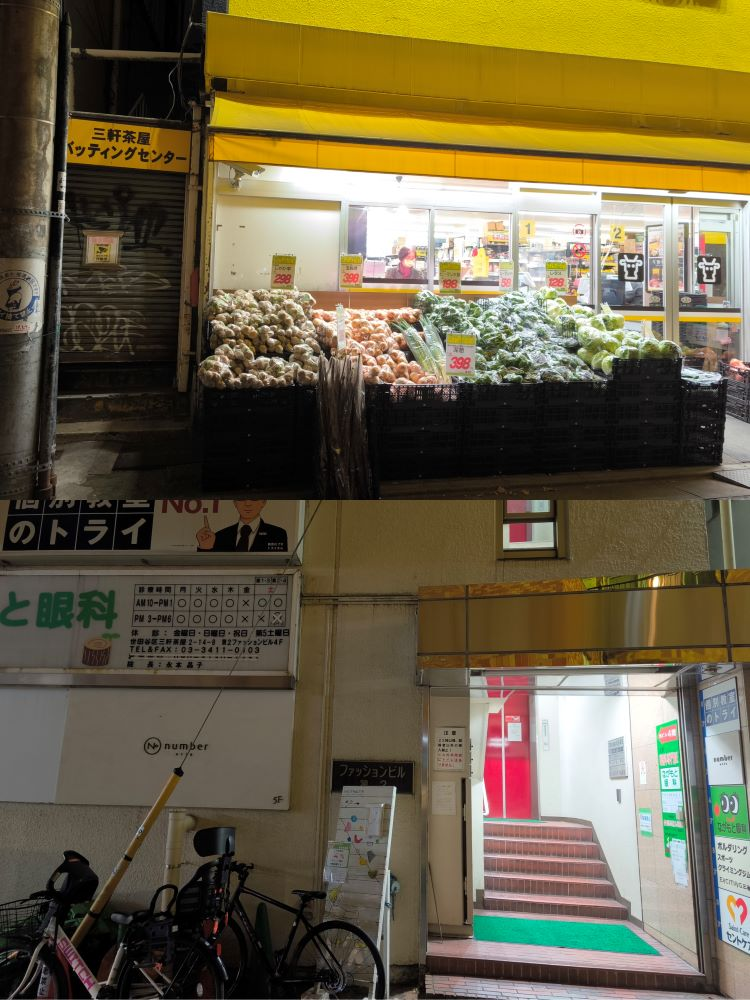

# 正的留学日记 - 其九

## Save.14

- 11-21 日，周二。

今天试了下语校的老师再三推荐的纳豆。  
微波炉加热了一盒速热米饭，配着纳豆和小香肠吃的。

> 纳豆本身吃着没啥味道，闻着稍微有点怪味，吃着黏糊糊的。  
> 拌上自带的黄色芥末和酱油后好吃了些，黏黏酱油拌饭的感觉。  
> 呃，就是看着拉丝的样子，莫名有点恶心。。。

- 11-24 日，周五。

跟舍友去了学校附近的烤牛肉的店，点了个什么神户黑牛套餐。  
表面一层估计有个五分熟，下面的几乎就是生的，相当“新鲜”。  
味道还行，不过花了两千多但一半都是配菜，有点不划算。

- 11-26 日，周日。

今天逛着逛着去了板桥那边一家很大的生鲜超市，  
买了两盘猪肉、一袋蘑菇和一盒黑虎虾回来打火锅。

> 日本这边的火锅料不太行，没啥味，好在蘑菇不错，变成菌汤锅了。  
> 黑虎虾个头很大，口感挺弹，一盒十个两个人吃居然还有点多。

这周感觉没发生啥特别的事情，没啥可写的，跟下周一起吧。

---

## Save.15

- 11-27 日，周一

今天开始明显降温了。

又换座位了，千驮谷一月左右换一次。  
从最后排最右到最后排最左，这次又换到了最前排最右。。。  
搞人心态，我可怜的脖子啊。。。不过这次同桌是个美女，忍了。

- 12-01 日，周五

之前语校认识的同学带我去吃了加炸猪排店，  
感觉还不错，周五放学早，带着舍友又去了一趟。  
这家炸猪排真的是外焦里嫩，温泉蛋也相当漂亮。

晚上回去路上一起去了趟唐吉可德。  
以前都只去了一层和地下，买零食便当生肉啥动，没上去过。  
今天上去才发现原来唐吉可德的东西这么全！  
锅碗瓢盆到日用百货一应俱全，哪里需要跑那么远去 NITORI 啊！

> 就是 BGM 有点洗脑，逛久了容易造成精神污染。。。

## Save.16

- 12-03 日，周日。

今天 JLPT 考试，就是那个我脑残报了 N1 的考试。  
不出意外应该是寄了，前面的题感觉做着还行，  
但时间没掌握好，阅读最后还有五题都没来得及做。  
听力也不太行，完全没有考 STBJ 时的那种轻松感觉。

考场在三轩茶屋的日本大学，之前就觉得名字很耳熟，  
到了车站才想起来，四轩茶屋啊！这不是某十艘跳借宿的地方吗？！  
于是考完试去巡礼了一圈，果然找到不少熟悉的地方。

最好找的当然就是车站了：

然后是主角回家那条路：
> emmm，虽说 P5 不以景色出名，但现实中这地方也是在算不上干净漂亮。。。  
> 考虑了下要不要调下图加个滤镜以示尊重，想想还是算了，麻烦。。。

可惜才五点钟天就黑了，洗衣店、澡堂、咖啡厅也关了。

巷子口那里原来是家广岛烧（铁板烤面？），试了下还不错，挺有特色的。

最后是超市、棒球场通道，以及妙妙姐的快乐小诊所 ˋ( ° ▽、° ) ！
> 不过好破烂啊，要不是上网搜了巡游攻略我真不太认的出来这里。。。

另外回来路上在涩谷站换乘，本来准备顺便逛逛，  
出站看了一下，那叫个人山人海，还是算了吧。。。
